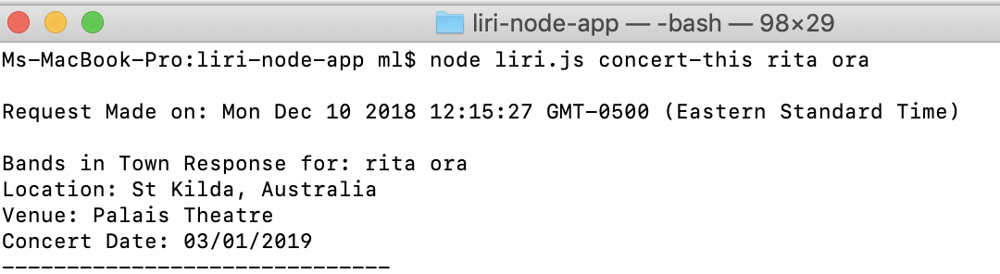
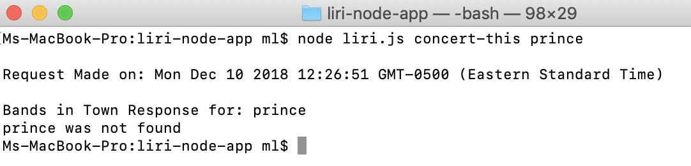
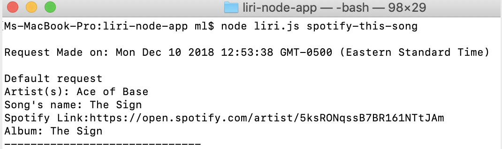
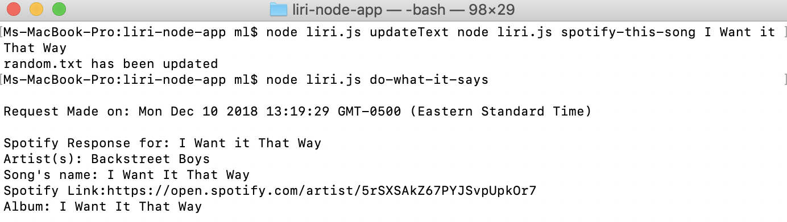
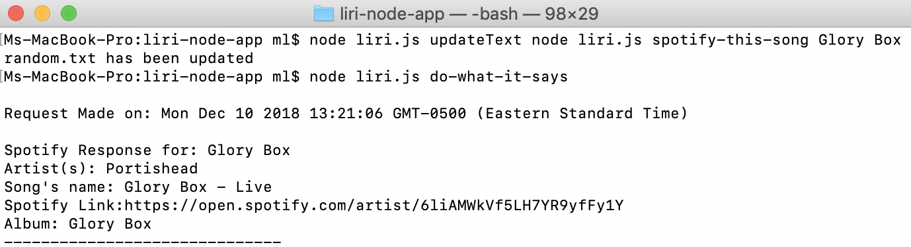
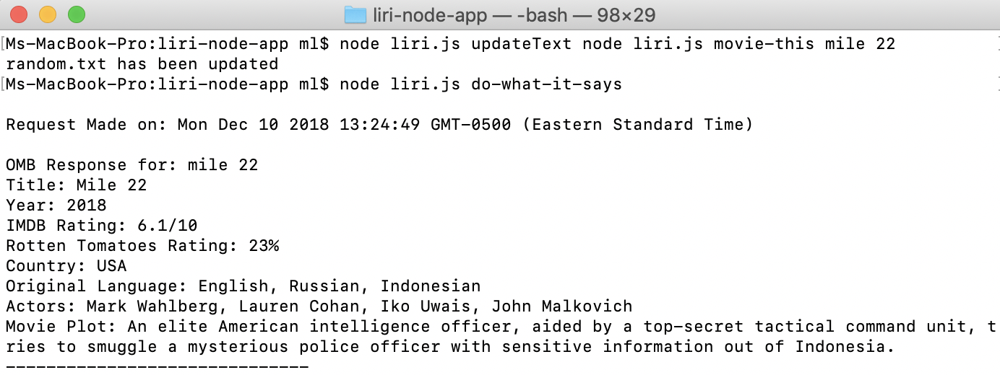

# LIRI APLICACTION

## Author
#### Marsha Leconte

## Application Overview
 The **LIRI** application is a Language Interpretation and Recognition Interface. The application leverages 
 the open source server environment, **Node**, as well as several Package Managers **(npm)**. **LIRI** also takes advantage of different **API** 
 to provide specific  information. **LIRI** has the capacity to render information about, **concerts, songs and movies**. 
 The Application makes use of four parameters dependent on which information the user desires.

# How to run LIRI

## Concerts Request
The concert-this parameter, which is used to receive information about concerts, must be executed 
in the following syntax structure: node liri.js concert-this **`<artist/band name here>`**

This request will return the following concert information:

1. The Location
2. The Venue 
3. The Date

The **LIRI** application will also inform you if it does not find the requested information regarding  an artist or band.

## Songs Request

The spotify-this-song  parameter, is used to render information about songs. In order to use this feature the following syntax must be used: node liri.js spotify-this-song **`<song name here>`**

This request will return the following information about the desired song:

1. The artist name
2. The song's name 
3. The song's Spotify link
4. The album's name

In case a parameter is not provided, the request defautls to the song "The Sign" by the Swedish pop group Ace of Base.

## Movie Request

The movie-this parameter is used to render information about movies. The following syntax must be used to execute the request: node liri.js movie-this **`<movie name here>`**

This request will return the following information about a movie:

1. The Title
2. The Year
3. The IMDB Rating
4. The Rotten Tomatoes Rating
5. The Country
6. The Original Language
7. The Actors
8. The Movie Plot

In case a parameter is not provided, the request defaults to the movie "Mr. Nobody"

## Running LIRI from a text File

The **LIRI** application also allows the user to execute it's commands from a text file. 
The LIRI syntax node **`liri.js do-what-it-says`**, will execute any command inscribed within the **random.txt** file.
The **random.txt** file may be updated using the updade function then using the **`node liri.js do-what-it-says`**  syntax will excecute the text within the file.

## Log File

The **LIRI** application provides the user with a log file, **data.txt**, which provides a list of her request. The file can be reviewed [HERE](https://github.com/urani100/liri-node-app/blob/master/data.txt)

## Note on Running LIRI

#### NPM Packages

The following **npm** packages are necessary to the application:

    1.axios
    2.dotenv
    3.file-system
    4.moment
    5.node-spotify-api
    6.request

#### Spotify Credentials

User must provide their own **SPOTIFY ID**  and **SPOTIFY SECRET KEY**. This information must be inserted in a .env file in the format below:

SPOTIFY_ID=your-spotify-id\
SPOTIFY_SECRET=your-spotify-secret

